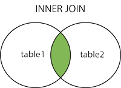
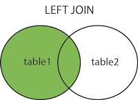
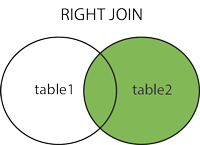
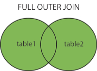

## Joins de SQL
SQL Join se utiliza para combinar filas de dos o más tablas.
Join se basa en un campo común entre las tablas.


### Ejemplo
La base de datos Northwind tiene la tabla Orders y la tabla Customers.
La tabla Orders se puede unir a la tabla Customers con la columna CustomerID (clave foránea).
Entonces, si quisiéramos conocer el nombre de la empresa detrás de cada pedido podríamos escribir:

```sql
SELECT Orders.OrderID, Customers.CompanyName, Orders.OrderDate
FROM Customers
	INNER JOIN Orders ON Customers.CustomerID = Orders.OrderID
ORDER BY Customers.CompanyName;
```


## INNER JOIN
* Join más común
* Selecciona TODAS las filas de AMBAS tablas DONDE existe una coincidencia entre las columnas en AMBAS tablas.
Sintaxis:

```sql
SELECT column_name(s)
FROM table1
    INNER JOIN table2 ON table1.column_name=table2.column_name;
```
o:

```sql
SELECT column_name(s)
FROM table1
    JOIN table2 ON table1.column_name=table2.column_name;
```
PS! INNER JOIN es lo mismo que JOIN.


## Diagrama de Venn de INNER JOIN



## LEFT JOIN
Devuelve TODAS las filas de la tabla izquierda con las filas COINCIDENTES de la tabla derecha.
Devuelve NULL para el lado derecho cuando no hay coincidencia.
Sintaxis:

```sql
SELECT column_name(s)
FROM table1
    LEFT JOIN table2 ON table1.column_name=table2.column_name;
```
o:

```sql
SELECT column_name(s)
FROM table1
    LEFT OUTER JOIN table2 ON table1.column_name=table2.column_name;
```
PS! En algunas bases de datos LEFT JOIN se llama LEFT OUTER JOIN.


## Ejemplo de LEFT JOIN
```sql
-- Obtener todos los clientes y sus pedidos.
SELECT Orders.OrderID, Customers.CompanyName, Orders.OrderDate
FROM Customers
	LEFT OUTER JOIN Orders ON Customers.CustomerID = Orders.CustomerID
ORDER BY Customers.CompanyName;
```


## Diagrama de Venn de LEFT JOIN



## RIGHT JOIN
Devuelve TODAS las filas de la tabla derecha con las filas COINCIDENTES de la tabla izquierda.
Devuelve NULL para el lado izquierdo cuando no hay coincidencia.
Sintaxis:
```sql
SELECT column_name(s)
FROM table1
    RIGHT JOIN table2 ON table1.column_name=table2.column_name;
```
o:
```sql
SELECT column_name(s)
FROM table1
    RIGHT OUTER JOIN table2 ON table1.column_name=table2.column_name;
```
PS! En algunas bases de datos RIGHT JOIN se llama RIGHT OUTER JOIN.


## Ejemplo de RIGHT JOIN
```sql
-- Obtener todos los pedidos y los clientes relevantes.
SELECT Orders.OrderID, Customers.CompanyName, Orders.OrderDate
FROM Orders
	RIGHT OUTER JOIN Customers ON Customers.CustomerID = Orders.CustomerID
ORDER BY Customers.CompanyName;
```


## Diagrama de Venn de RIGHT JOIN



## FULL OUTER JOIN
Devuelve TODAS las filas del lado izquierdo y TODAS del lado derecho.
Combina los resultados de los joins LEFT y RIGHT.
Sintaxis:

```sql
SELECT column_name(s)
FROM table1
    FULL OUTER JOIN table2 ON table1.column_name=table2.column_name;
```


## Ejemplos de FULL JOIN
```sql
-- Obtener todos los pedidos y todos los clientes, combinados.
SELECT Orders.OrderID, Customers.CompanyName, Orders.OrderDate
FROM Orders
	FULL OUTER JOIN Customers ON Customers.CustomerID = Orders.OrderID
ORDER BY Customers.CompanyName;
```


## Diagrama de Venn de FULL JOIN



## Declaración GROUP BY
Se utiliza en conjunto con funciones agregadas para agrupar el conjunto de resultados por una o más columnas
Sintaxis:
Una columna agrupada
```sql
SELECT column_name, aggregate_function(column_name2)
FROM table_name
WHERE column_name operator value
GROUP BY column_name;
```
Más de una columna agrupada
```sql
SELECT column_name1, column_name2, aggregate_function(column_name3)
FROM table_name
WHERE condition
GROUP BY column_name1, column_name2;
```


##Ejemplo de GROUP BY
```sql
-- ¿Cuántos pedidos ha realizado cada cliente del Reino Unido?
SELECT Customers.CompanyName, COUNT(Orders.OrderID)
FROM Customers
	LEFT JOIN Orders ON Customers.CustomerID = Orders.CustomerID
WHERE Customers.Country = 'UK'
GROUP BY Customers.CompanyName;
```


## Ejemplo de GROUP BY con más columnas
```sql
-- ¿Cuántos objetos ha pedido cada cliente del Reino Unido cada año?
SELECT Customers.CompanyName, YEAR(Orders.OrderDate), SUM( [Order Details].Quantity )
FROM Customers
	INNER JOIN Orders ON Customers.CustomerID = Orders.CustomerID
	INNER JOIN [Order Details] ON Orders.OrderID = [Order Details].OrderID
WHERE Customers.Country = 'UK'
GROUP BY Customers.CompanyName, YEAR(Orders.OrderDate)
ORDER BY Customers.CompanyName, YEAR(Orders.OrderDate);
```


## Alias de SQL
Se utilizan para renombrar temporalmente una tabla o un encabezado de columna
## Sintaxis de alias de SQL para columnas
```sql
SELECT column_name AS alias_name
FROM table_name;
```
## Sintaxis de alias de SQL para tablas
```sql
SELECT column_name(s)
FROM table_name AS alias_name;
```


## Ejemplo de alias de SQL
¿Cuántos objetos ha pedido cada cliente del Reino Unido cada año y cuánto pagaron?
```sql
SELECT C.CompanyName AS [Company Name],
		YEAR(O.OrderDate) AS [Year of Order],
		SUM( OD.Quantity ) AS [Total Quantity],
		SUM( OD.Quantity * OD.UnitPrice * (1-OD.Discount)) AS [Total Revenues]
FROM Customers AS C
	INNER JOIN Orders AS O ON C.CustomerID = O.CustomerID
	INNER JOIN [Order Details] AS OD ON O.OrderID = OD.OrderID
WHERE C.Country = 'UK'
GROUP BY C.CompanyName, YEAR(O.OrderDate)
ORDER BY C.CompanyName, YEAR(O.OrderDate);
```


## Declaración INSERT INTO
Se utiliza para insertar nuevos registros en una tabla
Sintaxis:
Insertar con valores para TODAS las columnas
```sql
INSERT INTO table_name
VALUES (value1,value2,value3,...);
```
o
Insertar con valores solo para columnas especificadas
```sql
INSERT INTO table_name (column1,column2,column3,...)
VALUES (value1,value2,value3,...);
```


## Ejemplo de declaración INSERT INTO
```sql
INSERT INTO  Suppliers(CompanyName, ContactName, Address, City, PostalCode, Country)
VALUES ('Cardinal','Tom B. Erichsen','Skagen 21','Stavanger','4006','Norway');
```


## Declaración DELETE
Elimina una o más filas de una tabla
Sintaxis:
```sql
DELETE FROM table_name
WHERE some_column=some_value;
```
Atención: ¡Si no se especifica la cláusula WHERE, se eliminarán TODOS los registros!


## Ejemplo de declaración DELETE
```sql
-- Elimina de la tabla Suppliers todos los registros con CompanyName = 'Cardinal'
DELETE FROM Suppliers
WHERE CompanyName = 'Cardinal';
```


## Declaración UPDATE
Actualiza registros existentes
Sintaxis:
```sql
UPDATE table_name
SET column1=value1,column2=value2,...
WHERE some_column=some_value;
```
Atención: ¡Si no se especifica la cláusula WHERE, se actualizarán TODOS los registros!


## Ejemplo de declaración UPDATE
```sql
-- Actualiza el teléfono con un nuevo valor para todas las empresas llamadas 'Cardinal'
UPDATE Suppliers
SET Phone = '(0)2-953010'
WHERE CompanyName = 'Cardinal'
```


## TRANSACCIONES
Secuencia de operaciones realizadas como una sola unidad lógica de trabajo
Puedes revertir una transacción y deshacer los cambios en la base de datos o confirmarlos.
Ejemplo de sintaxis:
```sql
--Actualizar el Country de todos los clientes a Grecia y luego revertir los cambios
BEGIN TRANSACTION
update customers
set Country = 'Greece';

select Country, *
from Customers;

ROLLBACK

select Country, *
from Customers;

```


## Consejos y trucos para los ejercicios
* Usa alias para nombres de tablas (ej. SELECT C.CompanyName FROM Customers AS C)
* Usa DISTINCT para resultados distintos (para propósitos de verificación)
* BEGIN TRANSACTION ... ROLLBACK para comandos INSERT, UPDATE, DELETE
* Usa @@ROWCOUNT para verificar el número de filas afectadas
* Usa siempre la cláusula WHERE para comandos DELETE y UPDATE
* Intenta nunca usar CURSORS y bucles WHILE
* Prefiere variables de tabla a tablas temporales
