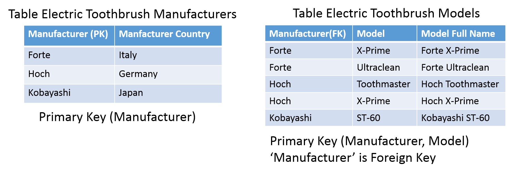
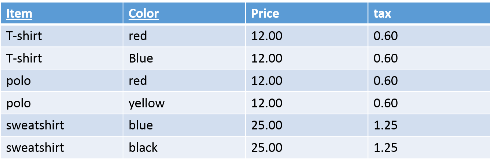

## Normalización de Bases de Datos

## Antecedentes y terminología
* ¿Qué es una base de datos relacional?
* ¿Qué es una clave primaria?
* ¿Qué es una clave foránea?

## Sistema de Gestión de Bases de Datos Relacionales (RDBMS)
* Colección de información organizada en tablas
  * Las tablas también son relaciones
* Las tablas se construyen y se asocian entre sí a través de campos compartidos: campos "comunes"
  * Los campos también son "columnas" o "atributos"
* Un conjunto de atributos comprende un registro
  * Los registros también son "filas" o "tuplas"
* Las tablas se relacionan a través de campos comunes designados como claves primarias y foráneas
* Permite actualizar y eliminar datos mientras se garantiza la precisión

## Campos de Clave Primaria y Clave Foránea
* Clave Primaria
  * Los campos de clave primaria deben ser únicos y no pueden contener un valor nulo
  * Cada tabla debe tener un campo de clave primaria
  * Claves concatenadas: usar más de un campo como campo de clave primaria

* Clave foránea
  * Campos en una tabla que hacen referencia a la clave primaria en otra tabla
  * Los datos en este campo deben coincidir exactamente con los datos contenidos en el campo de clave primaria

## Modelo de base de datos relacional
* Principio de diseño básico del modelo de base de datos relacional
  * Agrupar tipos de atributos de una entidad
  * Crear tablas para los tipos de entidad
  * Correlacionar tablas como se han definido en el diagrama E-R
* Las preguntas que surgen durante el proceso mencionado tienen que ver con la selección de los atributos que se agruparán y formarán una tabla
  * ¿Según qué criterio realizamos la selección?
  * ¿Existe alguna mejor combinación de los atributos que podría llevar a una base de datos más flexible y confiable?
* Presentación de las reglas básicas seguidas durante el diseño de una base de datos

## Anomalías en bases de datos
* Anomalías de actualización
  * Si los elementos de datos están dispersos y no están vinculados entre sí correctamente, podría conducir a situaciones extrañas. Por ejemplo, cuando intentamos actualizar un elemento de datos que tiene copias dispersas en varios lugares, algunas instancias se actualizan correctamente mientras que otras se quedan con valores antiguos. Tales instancias dejan la base de datos en un estado inconsistente.

* Anomalías de eliminación
  * Intentamos eliminar un registro, pero partes de él quedaron sin eliminar debido al desconocimiento, los datos también se guardan en otro lugar

* Anomalías de inserción
  * Intentamos insertar datos en un registro que no existe en absoluto

* La normalización es un método para eliminar todas estas anomalías y llevar la base de datos a un estado consistente

## ¿Qué es la Normalización?
* El proceso por el cual organizamos eficientemente los datos para lograr estos objetivos:
  * Eliminar la redundancia
  * Asegurar que los datos se almacenen en la tabla correcta
  * Eliminar la necesidad de reestructurar la base de datos cuando se agregan datos

* Cinco niveles de forma normal
  * Para lograr un nivel de forma normal, se debe cumplir cada nivel anterior

* La tercera forma normal es suficiente para la mayoría de las aplicaciones de bases de datos típicas

## Problema sin normalización
* Sin normalización, se vuelve difícil manejar y actualizar la base de datos, sin enfrentar pérdida de datos
* Las anomalías de inserción, actualización y eliminación son muy frecuentes si la base de datos no está normalizada

## Anomalía de inserción
* Supongamos que para una nueva admisión, tenemos un Student id (S_id), nombre y dirección de un estudiante, pero si el estudiante aún no ha optado por ninguna materia, entonces tenemos que insertar NULL allí, lo que lleva a una anomalía de inserción

## Anomalía de actualización
* Para actualizar la dirección de un estudiante que aparece dos o más veces en una tabla, tendremos que actualizar la columna S_Address en todas las filas, de lo contrario los datos se volverán inconsistentes

## Anomalía de eliminación
* Si (S_id) 401 tiene solo una materia y temporalmente la abandona, cuando eliminemos esa fila, todo el registro del estudiante se eliminará junto con ella

## Visión general de la normalización
* La normalización es un proceso de organización de los datos en la base de datos para evitar la redundancia de datos, anomalía de inserción, anomalía de actualización y anomalía de eliminación.

* Las formas normales más comúnmente utilizadas:
  * Primera forma normal (1NF)
  * Segunda forma normal (2NF)
  * Tercera forma normal (3NF)

## 1ra Forma Normal
Primera forma normal: Un atributo (columna) de una tabla no puede contener múltiples valores. Debe contener solo valores atómicos

## 1ra forma normal

## 1ra forma normal

* SELECT: ¿Son todas las consultas posibles factibles de expresar?
* INSERT: ¿Se pueden insertar nuevos datos sin requerir consultas complicadas?
* DELETE: ¿Se pueden eliminar datos sin perder información valiosa?
* UPDATE: ¿Se puede realizar la modificación de datos de manera fácil y sin modificar datos que no deberían verse afectados?

## 1ra forma normal – fallo en select

SELECT *
FROM employee
WHERE language = 'English'

Solución potencial:
SELECT *
FROM employee
WHERE language LIKE '%English%'

## 1ra forma normal – fallo en update

¿Qué sucede si queremos agregar el idioma 'English' a George?

Necesitamos saber que él ya habla francés:
UPDATE employee
SET language = 'French, English'
WHERE name = 'George'

## 1ra forma normal – Un enfoque alternativo

## 1ra forma normal – Nuevos problemas
* Almacenamiento: Se requiere más almacenamiento para datos que no son necesarios
* SELECT: Es más fácil de realizar. Los empleados que hablan un idioma específico son más fáciles de encontrar.
* INSERT: La inserción de datos es problemática.
* UPDATE: La actualización de datos es fácil de realizar.
* DELETE: La eliminación de datos es fácil de realizar

## 1ra forma normal

* Primera forma normal: Un atributo (columna) de una tabla no puede contener múltiples valores. Debe contener solo valores atómicos

## 1ra forma normal

## 1ra forma normal
* El atributo multivalor se convierte en una relación "Muchos-a-Muchos"

## 1ra forma normal – En resumen
* La primera forma normal (1NF) establece las reglas más básicas para una base de datos organizada
  * No hay campos repetidos o duplicados
  * Cada celda contiene solo un valor único
  * Cada registro es único (identificado por una clave primaria)

## 1ra forma normal – En resumen

## Dependencias Funcionales
* Una dependencia funcional se define como una asociación entre los atributos de una tabla
  * Supongamos que dado el valor de un atributo, podemos obtener el valor de otro atributo
* Un atributo B se considera funcionalmente dependiente de un atributo A si el valor de A establece de manera única el valor de B
* La asociación mencionada se representa como A → B
  * Se lee como: A determina B o B depende de A

## Dependencias funcionales – ejemplo 1
Ejemplos de dependencias funcionales:
* ZipCode → AddressCity
  * 16652 es el código postal de Huntingdon
* ArtistName → BirthYear
  * Picasso nació en 1881
* Autobrand → Manufacturer, Engine type
  * Pontiac es construido por General Motors con motor de gasolina
* Author, Title → PublDate
  * Hamlet de Shakespeare fue publicado en 1600

## Dependencias funcionales – ejemplo 2

Decimos que un atributo B tiene una dependencia funcional de otro atributo A, si para dos registros cualesquiera que tienen el mismo valor para A, entonces los valores para B en estos dos registros deben ser los mismos

## Dependencias funcionales – ejemplo 3

Conociendo el nombre del equipo podemos identificar de manera única la liga en la que participa

## Dependencias funcionales – ejemplo 4

## Dependencias funcionales
* Una dependencia funcional puede ser completa o parcial
  * Dependencia completa
  * Dependencia parcial
* Una dependencia parcial es una situación en la que un atributo no primo depende funcionalmente de una porción/parte de una clave primaria/clave candidata
* Una dependencia funcional es una dependencia funcional completa cuando la eliminación de cualquier atributo significa que la dependencia ya no se mantiene

## 2da Forma Normal
Segunda forma normal: un tipo de entidad está en segunda forma normal (2NF) cuando está en 1NF y cuando cada atributo no clave, cualquier atributo que no sea parte de la clave primaria, depende completamente de la clave primaria

## 2da Forma Normal – ejemplo 1

2NF: Ningún atributo no primo depende del subconjunto propio de ninguna clave candidata de la tabla

## 2da Forma Normal – ejemplo 1
* La clave primaria es compuesta
  * Comprende los atributos 'Title' y 'Actor'
* Ocurren las siguientes dependencias funcionales:
  * {title, actor} → director
  * title → director

## 2da forma normal – Enfoque

## 2da forma normal – Ejemplo 1
* Dividimos la tabla inicial en las siguientes dos:

## 2da forma normal – Ejemplo 2

{Manufacturer, Model} → Manufacturer Country

## 2da forma normal – Ejemplo 2
* Dividimos la tabla inicial en las siguientes dos:

## 2da forma normal – En resumen
* Se dice que una tabla está en segunda forma normal (2NF) si se cumplen las dos condiciones siguientes:
  * La tabla está en primera forma normal (1NF)
  * Ningún atributo no primo depende del subconjunto propio de ninguna clave candidata de la tabla

## 3ra Forma Normal
Tercera forma normal: un tipo de entidad está en tercera forma normal (3NF) cuando está en 2NF y todos los campos no primarios dependen de la clave primaria

## 3ra Forma Normal
* Se refiere a las dependencias funcionales de atributos que no pertenecen a la clave primaria.
* Normalización con descomposición
  * La descomposición es el proceso de dividir una relación en dos o más relaciones para eliminar las redundancias y las anomalías correspondientes
  * La parte dependiente de la dependencia funcional Y → Z, (es decir, Z) se elimina de la tabla inicial
  * Las partes de la dependencia funcional Y → Z, (es decir, Y y Z) forman una nueva tabla con Y siendo la clave primaria.
  * La tabla inicial se puede producir uniendo las nuevas tablas

## 3ra Forma Normal

## 3ra Forma Normal
* 3NF requiere que la tabla inicial se divida en dos tablas
* La parte dependiente 'region' de la dependencia funcional region → country se elimina de la tabla
* Las partes de la dependencia funcional forman una nueva tabla con clave primaria el atributo 'region'

## 3ra Forma Normal

## 3ra forma normal – En resumen
* Se dice que una tabla está en tercera forma normal (3NF) si se cumplen las dos condiciones siguientes:
  * La tabla está en segunda forma normal (2NF)
  * Todos los campos no primarios dependen de la clave primaria

## Algunas buenas razones para NO normalizar
* Los joins son costosos
  * Normalizar tu base de datos a menudo implica crear muchas tablas.
  * De hecho, puedes terminar fácilmente con lo que podría parecer una consulta simple abarcando cinco o diez tablas.

* El diseño normalizado es difícil

* Lo rápido y sucio debe ser rápido y sucio
  * Si solo estás desarrollando un prototipo, simplemente haz lo que funcione rápidamente
  * El desarrollo rápido de aplicaciones a veces es más importante que el diseño elegante.

## Ejercicios

## Ejercicio 1
* Considera la siguiente tabla:

¿Cuál de las siguientes Dependencias Funcionales NO es correcta?
a) A → B
b) B → C
c) BC → A
d) AC → B

## Ejercicio 2
* Considera la siguiente tabla:

* ¿Cuál de las siguientes Dependencias Funcionales se satisfacen?
* a) XY → Z, Z → Y
* b) XZ → X, Y → Z
* c) YZ → X, X → Z
* d) XZ → Y, Y → X

## Ejercicio 3
* ¿Cuál es el esquema de BD para el siguiente diagrama E-R?
* Cada empleado puede tener desde ningún correo electrónico hasta dos cuentas de correo electrónico

## Ejercicio 4
* Convierte la siguiente tabla a la Primera Forma Normal

## Ejercicio 5
* Convierte la siguiente tabla a la Tercera Forma Normal

## Ejercicio 6
* Convierte la siguiente tabla a la Segunda Forma Normal

